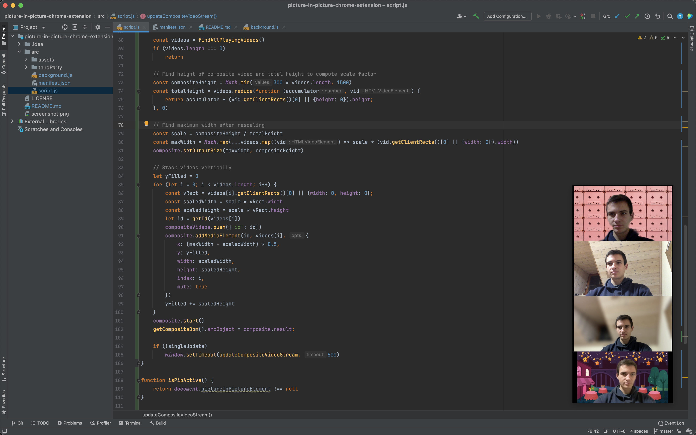

# MultiPiP in Google Meet
See all participants of Google Meet conferences in an overlay while working in other apps at the same time!  
Use `Alt-P` to toggle the overlay. Get it on the Chrome Web Store

### While working:

### In the meeting:

## MultiPiP Chrome Extension
MultiPiP is a Chrome Extension enabling Picture-in-Picture of multiple videos. Use it on any website to create an overlay playing all videos simultaneously.

## Configuration
The keyboard shortcut (defaults to `Alt-P`) can be changed on the
Chrome Extension Shortcuts settings page:
chrome://extensions/shortcuts
